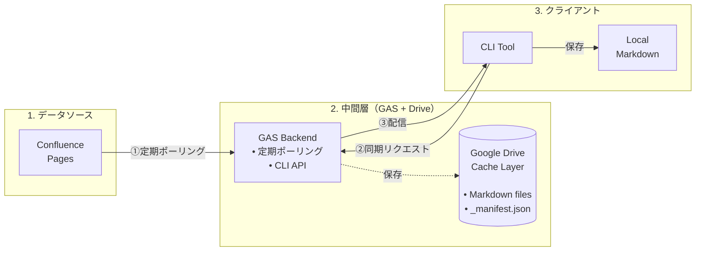
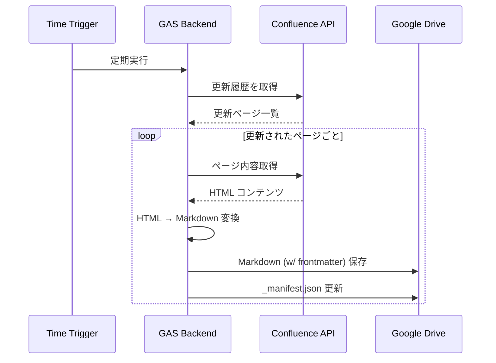
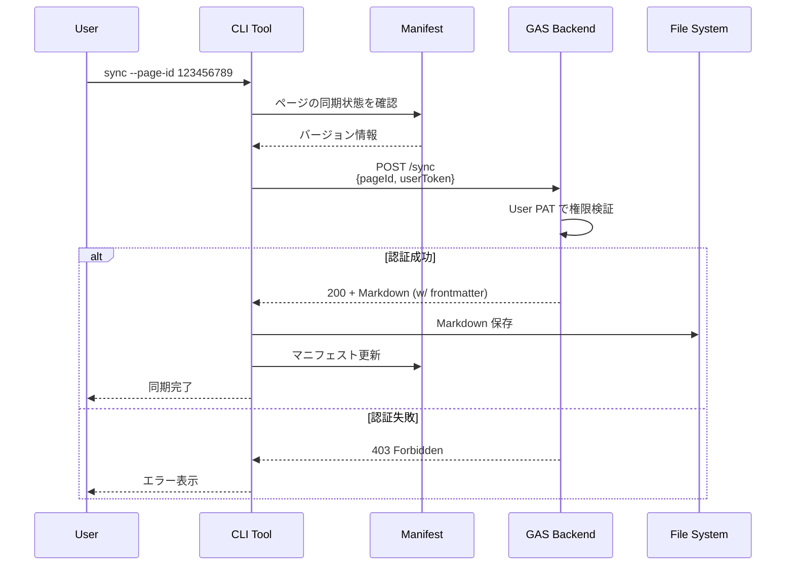

## システムアーキテクチャ

### 全体構成



## 技術スタック詳細

### 1. GAS Backend

| 項目 | 技術・仕様 |
|------|------------|
| 言語 | TypeScript → JavaScript (ビルド後) |
| ランタイム | Google Apps Script V8 Runtime |
| API | Confluence REST API v2 |
| ストレージ | Google Drive API |
| 定期実行 | Time-based Trigger (例: 1時間ごと) |
| HTTP エンドポイント | doPost() 関数 |

#### 主要モジュール

```typescript
// 疑似コード（実装イメージ）
namespace ConfluenceSync {
  // Confluence API クライアント
  class ConfluenceClient {
    constructor(baseUrl: string, token: string)
    getPageHistory(pageId: string): PageHistory[]
    getPageContent(pageId: string): ConfluencePageContent
    verifyAccess(pageId: string, token: string): boolean
  }

  // Markdown 変換エンジン
  class MarkdownConverter {
    convertHtmlToMarkdown(html: string): string
    // 個別の変換ロジック
    private convertHeadings(html: string): string
    private convertLists(html: string): string
    private convertTables(html: string): string
    private convertCodeBlocks(html: string): string
  }

  // Google Drive 管理
  class DriveManager {
    savePage(category: string, pageId: string, markdown: string, metadata: PageMetadata): void
    updateManifest(category: string, pageId: string, metadata: PageMetadata): void
    getPage(pageId: string): string
    getManifest(category: string): CategoryManifest
    listPages(category?: string): PageInfo[]
  }

  // 定期実行ハンドラー
  function pollConfluenceUpdates(): void

  // HTTP エンドポイント
  function doPost(e: GoogleAppsScript.Events.DoPost): GoogleAppsScript.Content.TextOutput
}
```

### 2. CLI Tool

| 項目 | 技術・仕様 |
|------|------------|
| 言語 | TypeScript |
| ランタイム | Bun |
| リント/フォーマット | Biome |
| HTTP クライアント | Bun の標準 fetch API |
| ファイル操作 | Bun の File API |
| 設定管理 | JSON ファイル (.confluence-sync.json) |

#### ディレクトリ構造（想定）

```
confluence-local-sync/
├── src/
│   ├── commands/
│   │   ├── sync.ts       # 同期コマンド
│   │   ├── list.ts       # ローカルファイル一覧
│   │   └── search.ts     # 検索コマンド
│   ├── lib/
│   │   ├── gas-client.ts     # GAS API クライアント
│   │   ├── manifest.ts       # マニフェスト管理
│   │   └── file-manager.ts   # ファイル操作
│   ├── types/
│   │   └── index.ts      # 型定義
│   └── index.ts          # CLI エントリーポイント
├── package.json
├── biome.json
└── tsconfig.json
```

#### 主要モジュール

```typescript
// 疑似コード（実装イメージ）

// GAS API クライアント
class GASClient {
  constructor(private endpoint: string, private token: string) {}

  async syncPage(pageId: string): Promise<SyncResponse> {
    const response = await fetch(this.endpoint, {
      method: 'POST',
      headers: { 'Content-Type': 'application/json' },
      body: JSON.stringify({ pageId, token: this.token })
    })
    return response.json()
  }
}

// マニフェスト管理
class Manifest {
  private data: ManifestData

  load(): void
  save(): void
  getPageState(pageId: string): PageState | null
  updatePageState(pageId: string, state: PageState): void
  needsSync(pageId: string, remoteVersion: string): boolean
}

// ファイルマネージャー
class FileManager {
  async saveMarkdown(pageId: string, content: string): Promise<void>
  async readMarkdown(pageId: string): Promise<string>
  listLocalPages(): string[]
}

// コマンド実装
async function syncCommand(options: SyncOptions): Promise<void>
async function listCommand(options: ListOptions): Promise<void>
```

## データモデル

### 1. Markdown ファイル (Google Drive)

Markdown ファイルの frontmatter としてメタデータを保存：

```markdown
---
pageId: "123456789"
title: "画面仕様書: ログイン画面"
version: 42
lastModified: "2025-11-23T10:30:00Z"
author: "user@example.com"
category: "画面仕様書"
confluenceUrl: "https://confluence.example.com/pages/123456789"
---

# ログイン画面

## 概要
...
```

### 2. カテゴリ管理ファイル (Google Drive: `_manifest.json`)

各カテゴリフォルダに配置され、フォルダ内の全ページ情報を記録：

```json
{
  "category": "画面仕様書",
  "lastUpdated": "2025-11-23T12:00:00Z",
  "pages": {
    "123456789": {
      "pageId": "123456789",
      "title": "画面仕様書: ログイン画面",
      "version": 42,
      "lastModified": "2025-11-23T10:30:00Z",
      "fileName": "login-screen.md"
    },
    "987654321": {
      "pageId": "987654321",
      "title": "画面仕様書: ダッシュボード",
      "version": 15,
      "lastModified": "2025-11-22T14:20:00Z",
      "fileName": "dashboard.md"
    }
  }
}
```

### 3. ローカルマニフェストファイル (ローカル環境)

```json
{
  "version": "1.0",
  "lastSync": "2025-11-23T12:00:00Z",
  "pages": {
    "123456789": {
      "pageId": "123456789",
      "title": "画面仕様書: ログイン画面",
      "version": 42,
      "localPath": "./docs/login-screen.md",
      "lastSynced": "2025-11-23T12:00:00Z",
      "category": "画面仕様書"
    }
  }
}
```

### 4. GAS API レスポンス

```json
{
  "success": true,
  "page": {
    "pageId": "123456789",
    "title": "画面仕様書: ログイン画面",
    "version": 42,
    "markdown": "# ログイン画面\n\n## 概要\n...",
    "metadata": {
      "lastModified": "2025-11-23T10:30:00Z",
      "author": "user@example.com",
      "category": "画面仕様書"
    }
  }
}
```

## 処理フロー

### 1. GAS 定期ポーリング



### 2. CLI 同期処理



## セキュリティ設計

### 1. Personal Access Token の管理

- **システム管理者 PAT**:
  - 保存場所: GAS のスクリプトプロパティ（環境変数相当）
  - 用途: 定期ポーリング
  - 権限: 読み取り専用（Confluence ページの閲覧のみ）
- **ユーザー PAT**:
  - 保存場所: `~/.confluence-sync/config.json` または環境変数
  - 用途: CLI 同期時の認証
  - 権限: 読み取り専用（Confluence ページの閲覧のみ）
- **通信**: HTTPS のみ

### 2. GAS エンドポイントの保護

- **アクセス制御の仕組み**:
  - システム管理者 PAT で事前取得したページ（= Google Drive に保存済み）のみが配信対象
  - CLI 同期時、ユーザー PAT で Confluence API にアクセスし、閲覧権限を確認
  - システム管理者 PAT でアクセス可能かつユーザー PAT でアクセス可能なページのみ返す
- **レート制限**: 同一ユーザーからの過剰なリクエストを制限

### 3. Google Drive のアクセス制御

- GAS からのみアクセス可能
- ユーザーが直接 Google Drive にアクセスすることは想定しない
- CLI は GAS API 経由でのみデータを取得

## パフォーマンス最適化

### 1. API リクエストの削減

- **差分同期**: マニフェストで管理し、更新されたページのみ同期
- **バッチ処理**: 複数ページを一度に処理し、HTTP リクエストのオーバーヘッドを削減
- **キャッシュ活用**: Google Drive をキャッシュ層として使用

### 2. Markdown 変換の効率化

- **正規表現の最適化**: パフォーマンスを考慮した実装
- **段階的変換**: 要素ごとに順次変換

## 拡張性の考慮

### Phase 3: MCP サーバー実装時の考慮事項

- **ファイル検索**: ローカル Markdown ファイルの全文検索
- **メタデータ活用**: タグ、カテゴリによるフィルタリング
- **インターフェース設計**: MCP プロトコルに準拠

### 将来的な拡張

- **リアルタイム同期**: Webhook を使った即時反映（GAS の制約を考慮）

## 技術的課題と解決策

### 課題 1: GAS のデプロイサイズ制約

**解決策**: 外部ライブラリを使わず、必要最小限の自作ロジックで実装

### 課題 2: Markdown 変換の複雑さ

**解決策**: MVP では基本要素のみ対応し、段階的に拡張

### 課題 3: 大量ページの同期

**解決策**:
- 初回は手動で必要なページのみ指定
- 差分同期で効率化
- バッチ処理で複数ページを一度に同期

## 開発ロードマップ

### Phase 1: GAS Backend (2-3週間)

- [ ] Confluence API 連携
- [ ] HTML → Markdown 変換ロジック
- [ ] Google Drive 保存機能
- [ ] HTTP エンドポイント実装

### Phase 2: CLI Tool (2-3週間)

- [ ] プロジェクトセットアップ (Bun + TypeScript + Biome)
- [ ] GAS API クライアント
- [ ] マニフェスト管理
- [ ] 同期コマンド実装
- [ ] エラーハンドリング

### Phase 3: MCP Server (2週間)

- [ ] MCP プロトコル実装
- [ ] ファイル検索機能
- [ ] AI エージェントとの連携テスト
