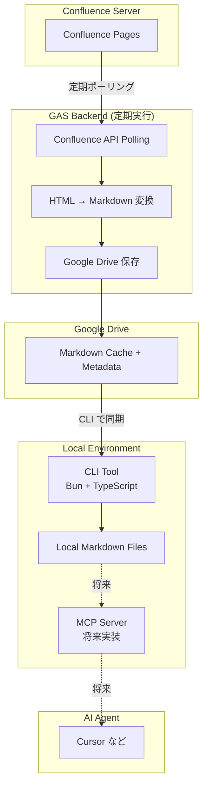

## プロジェクト概要

社内 Confluence で管理されているドキュメントをローカル環境に同期し、AI エージェント（Cursor など）が MCP サーバー経由でアクセスできるようにする仕組みを構築します。

## 背景・課題

- 社内の主要な情報が Confluence に集約されている
- AI エージェントが社内情報にアクセスできない
- Confluence API から取得したデータには HTML タグなどノイズが多い
- 大量リクエストによるサーバー負荷を避ける必要がある
- 事業部として専用サーバーを建てることはできない制約

## 解決アプローチ

1. GAS（Google Apps Script）をバックエンドとして活用し、定期的に Confluence ページを取得・Markdown 変換します。
2. Markdown形式に変換した Confluence ページを Google Drive にキャッシュします。
3. ユーザーは CLI ツールで必要なページをローカルに同期します。

## システム構成

## 技術スタック

- **バックエンド**: Google Apps Script (GAS)
- **CLI ツール**: Bun + TypeScript + Biome
- **ストレージ**: Google Drive
- **形式**: Markdown（Confluence HTML から変換）

## 開発フェーズ

1. **Phase 1**: GAS バックエンド + Markdown 変換
2. **Phase 2**: CLI ツール（同期機能）
3. **Phase 3**: ローカル MCP サーバー（AI エージェント連携）

## ドキュメント構成

- [01. アイデア・背景](./01_idea/) - なぜこのツールが必要か
- [02. 要件定義](./02_requirements/) - 機能要件・非機能要件
- [03. 技術仕様](./03_specifications/) - アーキテクチャ・実装詳細
